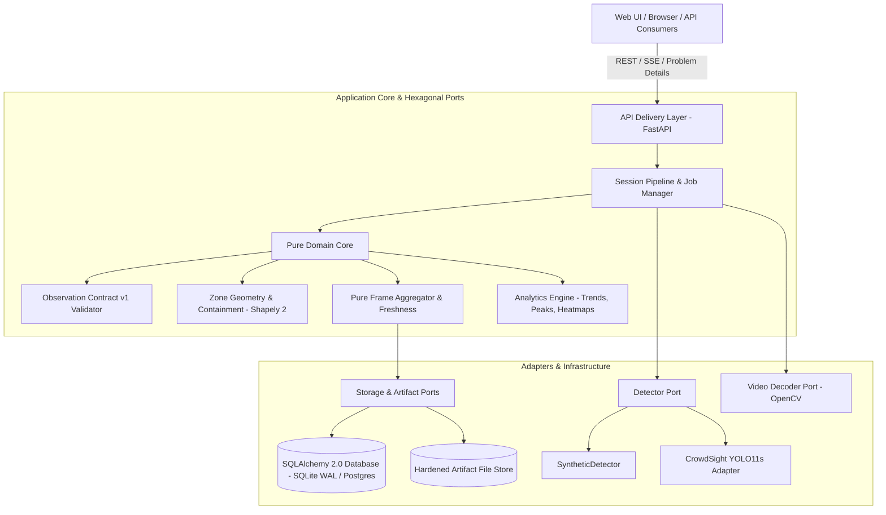

# CrowdSight Architecture & System Design

## 1. Executive Summary

CrowdSight is a specialized video replay and crowd monitoring application built for fixed-camera surveillance. The application provides truthful visible person detection, named zone counting over time, and relative image-space heat map generation (`IMAGE_SPACE`).

To maintain strict safety invariants, operational alerts and metric density (people/m²) are strictly disabled (`EXPERIMENTAL_NO_APPROVAL`, fail-closed).

---

## 2. High-Level Architecture (Hexagonal / Layered)

The service is organized cleanly into domain, port, adapter, and delivery layers to isolate I/O from core business and contract rules.

---

## 3. Core Architectural Components

### 3.1 Pure Domain Layer (`src/crowdsight/service/domain/`)
- **Observation Contracts (`contracts.py`)**: Pydantic v2 schemas rigorously adhering to `contracts/v1/crowd-frame-observation.schema.json`.
- **Two-Stage Validator (`validator.py`)**:
  - *Stage 1*: Structural JSON Schema draft 2020-12 validation.
  - *Stage 2*: Cryptographic and geometric cross-checks (box coordinates within image dimensions, bottom-centre anchor verification, tracker hash coupling, and zone-set coverage).
- **Zone Geometry (`zones.py`)**: Pure Shapely 2 polygon geometry. Enforces validity, non-self-intersection (`is_simple`), boundary containment, and minimum polygon area.
- **Aggregation Engine (`aggregation.py`)**: Computes zone visibility based on bottom-centre anchor inclusion. Strictly enforces invariant:
  $$\text{visible\_count} \neq \text{null} \iff \text{availability} = \text{'COUNTED'}$$
  Frames with `UNKNOWN` or `STALE` quality strictly yield unavailable states, never zero.
- **Freshness Policy (`freshness.py`)**: Evaluates temporal gap between requested playback time $t$ and observation time $t_{\text{obs}}$. If $(t - t_{\text{obs}}) > \text{freshness\_max\_gap\_s}$, flags the frame as `STALE`.

### 3.2 Storage & Persistence (`src/crowdsight/service/storage/`)
- **SQLAlchemy 2.0 Declarative Models**: Fully typed declarative models with SQLite WAL mode in development and PostgreSQL compatibility in production.
- **Database CHECK Constraint**: Hard constraint `ck_zone_result_visible_count_availability` preventing any database row from containing a visible count when availability is not `COUNTED`.
- **Artifact Storage (`src/crowdsight/service/artifacts/store.py`)**: Secure filesystem storage for generated PNG heatmaps, proxy videos, and JSONL/CSV exports. Implements path traversal hardening preventing directory escapes.
- **Data Retention Manager (`retention.py`)**: Automated cascade purges of expired sessions, associated artifacts, and database records with structured audit logging.

### 3.3 Video Pipeline & Job Runner (`src/crowdsight/service/pipeline/`)
- **Video Decoder (`decoder.py`)**: Sequential streaming frame extraction via OpenCV without loading entire video files into memory. Performs single-frame retry and detects decoder anomalies:
  - Blank or solid-color frames (`FRAME_BLANK`)
  - Frozen repetitive frames (`FRAME_FROZEN`)
  Degraded frames are categorized as `UNKNOWN` with explicit machine-readable reason codes.
- **Job Manager (`jobs.py`)**: Multi-state execution queue (`QUEUED` $\to$ `RUNNING` $\to$ `COMPLETED` / `FAILED` / `CANCELLED`). Supports cooperative cancellation, partial result preservation, and automated recovery of orphaned crashed workers on startup.
- **Model Boundary (`model_boundary.py`)**: Verifies SHA-256 digests of model profile configurations and weight checkpoints. Transparently routes to `SyntheticDetector` in zero-weight / CI environments.

### 3.4 Web Cockpit ("Footage Console") (`web/`)
- Built with React 18, TypeScript strict (`noUncheckedIndexedAccess`), Tailwind CSS tokenized variables, and Radix UI primitives.
- **Overlay Math (`overlayMath.ts`)**: Pure mathematical letterbox calculator maintaining sub-pixel coordinate alignment across window resizing, fullscreen mode, and zooming.
- **Annotated Canvas Player (`AnnotatedPlayer.tsx`)**: Synchronizes `<video>` and `<canvas>` layers. Renders bounding boxes strictly during `VALID` or `PARTIAL` frames, displays bottom-centre anchor points, zone polygons with labels, and Gaussian relative heat maps.
- **Multi-Tier Scrubber (`UnifiedTimeline.tsx`)**: Displays quality ribbons (`VALID`, `PARTIAL`, `UNKNOWN`, `STALE`), trend sparklines with physical gaps for unobserved intervals, and peak markers.

---

## 4. Security & Safety Boundaries

1. **Path Traversal Protection**: All filesystem inputs are sanitized. Clients refer strictly to server-cataloged `media_id`s, never arbitrary filesystem paths.
2. **Fail-Closed Governance**: Operational alerting endpoints return `operational_alerts_allowed: false` under `EXPERIMENTAL_NO_APPROVAL`.
3. **No Weights or Videos in Git**: Automated CI filters and `.dockerignore` prevent checkpoint binaries (`.pt`) and raw footage from entering source control.
