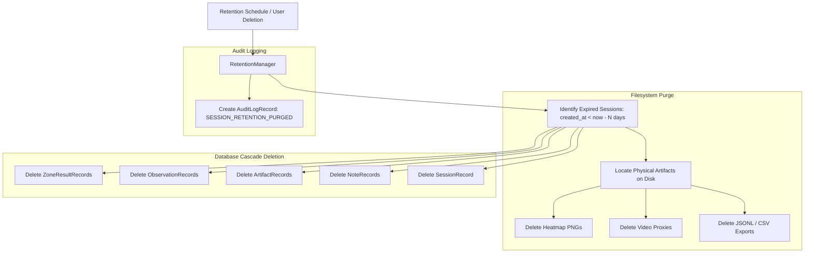

# CrowdSight Data Retention & Storage Policy

## 1. Overview & Policy Baseline

In accordance with [ADR-0006](decisions/ADR-0006-artifact-storage-and-retention.md), CrowdSight implements an automated, auditable data retention policy to prevent uncontrolled disk growth and ensure compliance with operational storage quotas.

- **Default Retention Window**: 30 days (`CROWDSIGHT_RETENTION_DAYS=30`), proposed pending final product approval.
- **Scope**: All analysis sessions, raw observation records, zone counts, operator notes, and generated filesystem artifacts.

---

## 2. Cascade Purge Lifecycle

When a session reaches the expiration threshold or is deleted via `DELETE /api/v1/sessions/{session_id}`:



---

## 3. Enforcement Mechanisms

### 3.1 Automated Retention Worker
- Executed on a scheduled periodic cron or background worker.
- Queries `SessionRecord.created_at < now() - interval '30 days'`.
- Deletes physical files safely via `ArtifactStore.delete_artifact()` with path-traversal validation.
- Emits structured audit log entries into `audit_log` table.

### 3.2 Operator CLI Purge
Operators can trigger on-demand purges using the CLI:
```bash
crowdsight session purge --older-than-days 30 --dry-run
crowdsight session purge --older-than-days 30 --force
```

### 3.3 User Cascaded Deletion
When an operator deletes a session in the Web UI:
- `DELETE /api/v1/sessions/{session_id}`
- Triggers immediate cascade deletion of database entities and removes the physical directory `/artifacts/{kind}/{session_id}/`.

---

## 4. Audit Logging & Compliance

Every purge operation generates an immutable `AuditLogRecord`:
```json
{
  "id": "audit-uuid-1234",
  "action": "SESSION_RETENTION_PURGED",
  "entity_type": "session",
  "entity_id": "session-5678",
  "actor": "system_retention_worker",
  "timestamp": "2026-09-30T04:00:00Z",
  "details": {
    "session_id": "session-5678",
    "max_age_days": 30,
    "created_at": "2026-08-31T04:00:00Z",
    "artifacts_removed": 4
  }
}
```
Audit log records are preserved indefinitely for compliance and forensic accountability.
